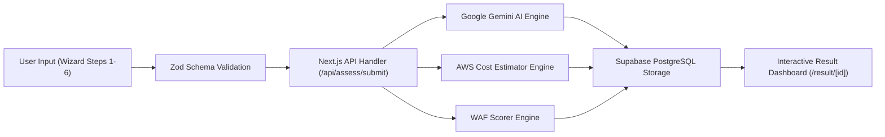

# 🏗️ Arch Advisor

> **AI-Powered Cloud Architecture Advisor AWS Well-Architected Framework Evaluator**

Arch Advisor is an intelligent cloud architecture advisor built with **Next.js 15**, **Google Gemini AI**, **Tailwind CSS**, and **Supabase**. It helps developers, DevOps engineers, and solutions architects design, evaluate, and estimate costs for production-grade AWS cloud infrastructure based on custom application requirements.

---

## 🌟 Key Features

- 🧙‍♂️ **Interactive Assessment Wizard**: 6-step guided wizard capturing workload types, traffic patterns, data requirements, SLAs, security sensitivity, and budget constraints.
- 🤖 **AI-Driven Architecture Generation**: Leverages Google Gemini AI to analyze system requirements and recommend tailored AWS architectures.
- 📊 **Visual Architecture Diagrams**: Automatically generates interactive, visual cloud architecture diagrams powered by Mermaid.js.
- 💰 **Automated Cost Estimator**: Calculates estimated monthly and yearly AWS cloud infrastructure costs broken down per service component.
- 🛡️ **AWS Well-Architected Framework (WAF) Scoring**: Computes pilar scores (Operational Excellence, Security, Reliability, Performance Efficiency, Cost Optimization) and presents interactive radar charts and actionable security checklists.
- 💾 **Persistence & Sharing**: Stores historical assessment results securely in Supabase PostgreSQL for easy sharing and review via unique assessment URLs.

---

## 🛠️ Tech Stack

- **Framework**: [Next.js 15](https://nextjs.org/) (App Router, Server Actions, Route Handlers)
- **Language**: [TypeScript](https://www.typescriptlang.org/)
- **AI Engine**: [Google Gemini AI API](https://ai.google.dev/) (`gemini-3.6-flash`)
- **Database & Auth**: [Supabase](https://supabase.com/) (PostgreSQL)
- **Styling & UI**: [Tailwind CSS](https://tailwindcss.com/), [Framer Motion](https://www.framer.com/motion/), [Lucide React](https://lucide.dev/)
- **Diagramming & Charts**: [Mermaid.js](https://mermaid.js.org/), [Recharts](https://recharts.org/)
- **Validation**: [Zod](https://zod.dev/)

---

## 🚀 Getting Started

Follow these instructions to set up and run Arch Advisor locally on your machine.

### Prerequisites

Ensure you have the following installed on your system:
- **Node.js**: `v18.x` or higher
- **npm** / **yarn** / **pnpm** / **bun**
- A **Supabase** project account (for PostgreSQL storage)
- A **Google Gemini API Key**

### 1. Clone the Repository

```bash
git clone https://github.com/your-username/arch-advisor.git
cd arch-advisor
```

### 2. Install Dependencies

```bash
npm install
```

### 3. Environment Variables Setup

Copy the sample environment file and populate it with your API credentials:

```bash
cp .env.example .env.local
```

Edit `.env.local` and add your keys:

```env
# Supabase Configuration
NEXT_PUBLIC_SUPABASE_URL=https://your-supabase-project.supabase.co
NEXT_PUBLIC_SUPABASE_ANON_KEY=your-supabase-anon-key

# Google Gemini AI Configuration
GEMINI_API_KEY=your-gemini-api-key
```

### 4. Database Setup (Supabase Migration)

Execute the SQL script located at `src/migrations/sep14.sql` in your Supabase SQL Editor to create the required tables and indexes.

### 5. Run Development Server

```bash
npm run dev
```

Open [http://localhost:3000](http://localhost:3000) in your browser to start using Arch Advisor.

---

## 📂 Project Structure

A brief overview of the directory organization inside `src/`:

```
src/
├── app/                  # Next.js App Router (Pages & API endpoints)
│   ├── assess/           # Multi-step wizard page
│   ├── result/[id]/      # Architecture evaluation result dashboard
│   └── api/assess/       # Backend route handlers for AI processing & DB persistence
├── components/           # React UI components
│   ├── ui/               # Header, Mermaid diagram renderer, etc.
│   ├── wizard/           # Step 1 to Step 6 assessment form components
│   └── result/           # WAF radar charts, cost breakdown, and architecture details
├── lib/                  # Core engines & utilities
│   ├── engine/           # Gemini AI integration, cost estimator, & WAF scorer
│   ├── supabase/         # Supabase client initialization
│   └── validations/      # Zod validation schemas
├── migrations/           # PostgreSQL migration SQL scripts
└── types/                # TypeScript interfaces and database types
```

> 📖 **Detailed Directory Documentation**: For a comprehensive breakdown of every file inside `src/`, read [srcExplain.md](srcExplain.md).

---

## 🔄 System Architecture Workflow



---

## 🤝 Contributing

Contributions are welcome! If you'd like to improve Arch Advisor:
1. Fork the repository.
2. Create a new feature branch (`git checkout -b feature/amazing-feature`).
3. Commit your changes (`git commit -m 'Add amazing feature'`).
4. Push to the branch (`git push origin feature/amazing-feature`).
5. Open a Pull Request.

---

## 📄 License

This project is licensed under the **MIT License** - see the [LICENSE](LICENSE) file for details.
