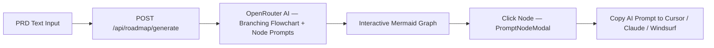
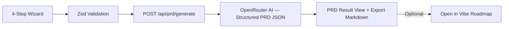
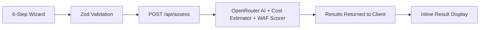

# Arch Advisor

> AI-Powered Architecture, PRD & Vibe Coding Suite

Arch Advisor is a full-stack AI toolkit built with **Next.js 16**, **OpenRouter AI**, and **Tailwind CSS**. Designed for vibe coders, founders, and solutions architects to go from a raw app concept all the way to a production-grade AWS cloud architecture — in minutes.

---

## Key Features

### Interactive Vibe Roadmap
Paste any PRD document and generate a non-linear, branching Mermaid flowchart with clickable nodes. Each node opens a modal containing an ultra-detailed AI prompt tailored for Cursor, Claude, Windsurf, or any AI coding assistant — ready to copy and paste.

### MVP PRD Generator
A 4-step guided wizard (App Concept → MVP Features → Tech Stack → SaaS & Services) that produces a GitHub-ready PRD markdown document. The output can be directly piped into the Vibe Roadmap generator.

### AWS Architecture Advisor
A 6-step wizard that analyzes workload type, traffic patterns, data requirements, SLA targets, security sensitivity, and budget constraints to generate:
- AWS architecture diagrams rendered via Mermaid.js
- AWS Well-Architected Framework (WAF) scores across 6 pillars with radar charts and security checklists
- Estimated monthly costs broken down per AWS service

---

## Tech Stack

| Layer | Technology |
|---|---|
| Framework | Next.js 16.3.5 — App Router, Route Handlers |
| Language | TypeScript 5 |
| AI Engine | OpenRouter (`openrouter/free`) via `@openrouter/ai-sdk-provider` + `ai` |
| Styling | Tailwind CSS v4, Framer Motion, Lucide React |
| Diagrams & Charts | Mermaid.js, Recharts |
| Validation | Zod v3, React Hook Form + `@hookform/resolvers` |
| Runtime | React 19.2, React DOM 19.2 |

---

## Getting Started

### Prerequisites

- Node.js `v18.x` or higher
- npm / yarn / pnpm / bun
- An OpenRouter API Key

### 1. Clone the Repository

```bash
git clone https://github.com/AZWALUWU/arch-advisor.git
cd arch-advisor
```

### 2. Install Dependencies

```bash
npm install
```

### 3. Environment Variables

Copy the sample environment file and fill in your credentials:

```bash
cp .env.example .env
```

Edit `.env`:

```env
# OpenRouter AI
OPENROUTER_API_KEY=your-openrouter-api-key
OPENROUTER_MODEL=openrouter/free
```

### 4. Run Development Server

```bash
npm run dev
```

Open [http://localhost:3000](http://localhost:3000).

---

## Project Structure

```
src/
├── app/                         # Next.js App Router
│   ├── page.tsx                 # Landing page
│   ├── layout.tsx               # Root layout with fonts & metadata
│   ├── globals.css              # Global Tailwind CSS styles
│   ├── icon.svg                 # SVG favicon
│   ├── roadmap/                 # Interactive Vibe Roadmap page
│   ├── prd/                     # MVP PRD Generator page
│   ├── assess/                  # Architecture Assessment wizard page
│   └── api/
│       ├── assess/              # Architecture analysis endpoint
│       ├── prd/generate/        # PRD generation endpoint
│       └── roadmap/generate/    # Roadmap flowchart generation endpoint
├── components/
│   ├── ui/                      # Header, MermaidDiagram renderer
│   ├── landing/                 # Hero, StatsBar, FeatureShowcase, CtaBanner
│   ├── wizard/                  # Steps 1-6 for architecture assessment
│   ├── prd/                     # 4-step PRD builder + result view
│   ├── roadmap/                 # Interactive flowchart, node modal, roadmap view
│   └── result/                  # WAF radar chart, cost chart, architecture detail
├── lib/
│   ├── engine/
│   │   ├── openrouter.ts          # OpenRouter provider instance & model config
│   │   ├── architect.ts           # OpenRouter AI — architecture analysis
│   │   ├── prd-generator.ts       # OpenRouter AI — PRD generation
│   │   ├── roadmap-generator.ts   # OpenRouter AI — branching roadmap flowchart
│   │   ├── cost-estimator.ts      # AWS cost estimation engine
│   │   └── waf-scorer.ts          # WAF pillar scoring engine
│   └── validations/             # Zod schemas for all three flows
└── types/
    └── database.ts              # TypeScript types for AI output & API payloads
```

For a comprehensive per-file breakdown, see [srcExplain.md](srcExplain.md).

---

## Application Workflows

### Vibe Roadmap



### MVP PRD Generator



### Architecture Evaluation



---

## Contributing

We welcome contributions! Please read our [Contributing Guide](CONTRIBUTING.md) for details on:

- Fork & clone setup
- Branching strategy (`feature` → `develop` → `main`)
- Development workflow
- Code style & conventions
- Commit message format
- Pull request guidelines
